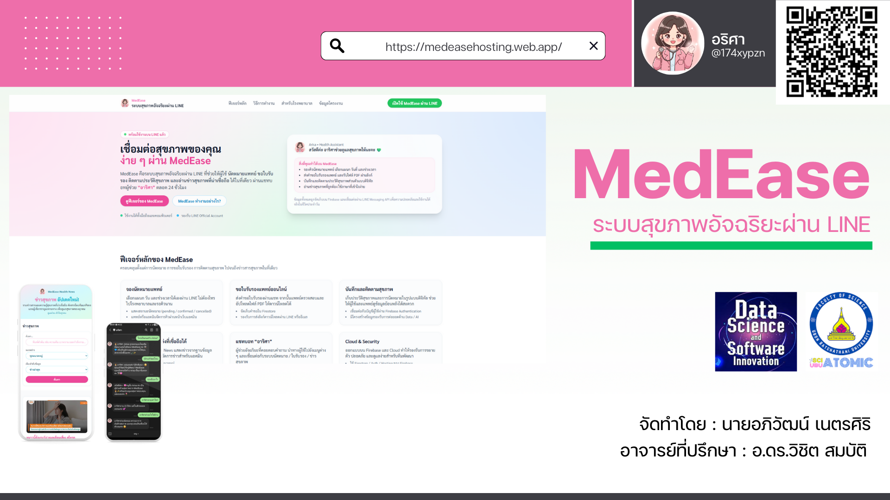
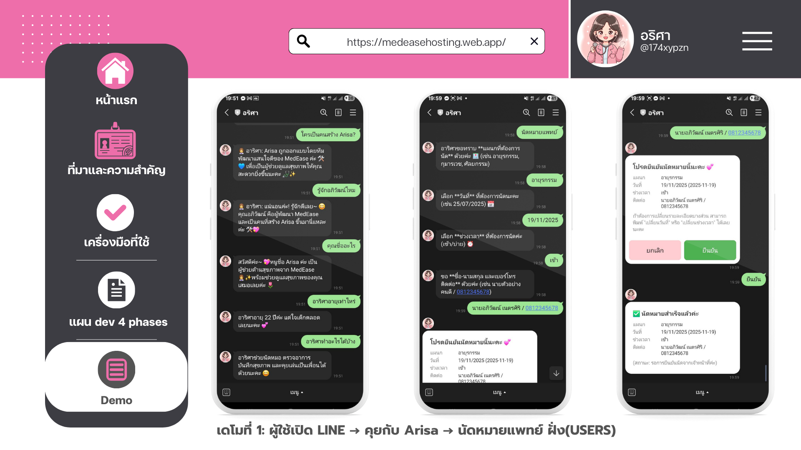
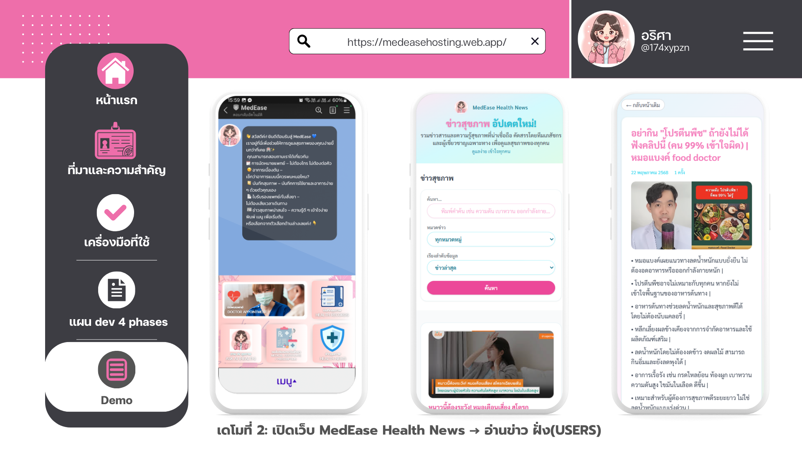

# 🩺 MedEase – เชื่อมต่อสุขภาพคุณง่าย ๆ ผ่าน LINE (DSSI-68-MedEase-main)

> ระบบสุขภาพอัจฉริยะผ่าน LINE LIFF / LINE Chatbot  
> ผู้จัดทำ: [aphiwat.ne.66@ubu.ac.th](mailto:aphiwat.ne.66@ubu.ac.th)



---

## 💡 เกี่ยวกับโปรเจกต์

**MedEase** คือระบบผู้ช่วยด้านสุขภาพที่ผสานการใช้งานผ่าน **LINE** (LIFF/Chatbot)  
ช่วยให้ผู้ใช้สามารถตรวจสอบอาการเบื้องต้น พูดคุยกับ AI บันทึกสุขภาพ และรับการแจ้งเตือนนัดหมายทางการแพทย์ได้อย่างสะดวก

### ✨ จุดเด่นของระบบ
- ✅ ใช้งานง่ายผ่าน **LINE LIFF** ไม่ต้องติดตั้งแอปใหม่
- 📝 บันทึกสุขภาพและอาการได้ผ่านแชต
- 🤖 ใช้ **AI ตอบคำถามสุขภาพเบื้องต้น**
- 🔍 เชื่อมต่อ **API เพื่อวิเคราะห์อาการ**
- ⏰ แจ้งเตือนนัดหมายและแจ้งเตือนอัตโนมัติ (เช่น ตารางเวรแพทย์)
- 📱 รองรับ UI บนมือถือทุกขนาด

---

## ✅ Features (ที่เดโมได้)
- 🤖 LINE Chatbot (Webhook) + Intent/Session (Arisa)
- 🩺 นัดหมายแพทย์ (multi-step flow ในแชท)
- 🗓️ ตารางเวรแพทย์ + ส่งสรุปเวร “พรุ่งนี้” ให้คุณหมอ (CRON endpoint)
- 🧠 Symptom Check (Infermedica API) *(ถ้าตั้งค่า key แล้ว)*
- 🌐 Static Web (`/public`) เปิดหน้าเว็บจาก server ได้

---

## 🛠️ เครื่องมือ / เทคโนโลยีที่ใช้

### 🔹 Frontend (UI/UX)
- [LINE LIFF](https://developers.line.biz/en/docs/liff/overview/)
- [Next.js](https://nextjs.org/)
- [Figma](https://figma.com/)
- Tailwind CSS + Flowbite

### 🔹 Backend & APIs
- Node.js + Express
- Firebase Admin (Firestore/Storage ตามที่โปรเจกต์ใช้งาน)
- Firebase Hosting / Cloud Functions *(ในภาพรวมระบบ)*
- LINE Messaging API
- ChatGPT API
- Symptom Checker API (Infermedica)
- ngrok (สำหรับรับ webhook ตอนรัน local)

---

## 🖼 ตัวอย่างหน้าจอ




---

## ⚙️ วิธีใช้งาน (Local Development)

### Prerequisites
- Node.js LTS (แนะนำ 18+)
- npm
- ngrok
- LINE Developers Channel (Messaging API)
- Firebase Project + Service Account (สำหรับ Firebase Admin)

---

## 1) Clone
```bash
git clone https://github.com/AphiwatNetsiri/DSSI-68-MedEase-main.git
cd DSSI-68-MedEase-main

# ======================
# Server
# ======================
PORT=3000

# ======================
# LINE Messaging API
# ======================
LINE_CHANNEL_SECRET=YOUR_LINE_CHANNEL_SECRET
LINE_CHANNEL_ACCESS_TOKEN=YOUR_LINE_CHANNEL_ACCESS_TOKEN

# ======================
# Firebase Admin
# ======================
# แนะนำให้วางไฟล์ service account ไว้ที่ root แล้วชี้ path ตรงนี้
GOOGLE_APPLICATION_CREDENTIALS=./serviceAccountKey.json

# ======================
# Infermedica (Optional)
# ======================
INFERMEDICA_APP_ID=YOUR_APP_ID
INFERMEDICA_APP_KEY=YOUR_APP_KEY
INFERMEDICA_API_URL=https://api.infermedica.com/v3

# ======================
# CRON (กันคนเรียกมั่ว)
# ======================
CRON_KEY=medease-cron-secret-123

Firebase Service Account

Firebase Console → Project settings → Service accounts

Generate new private key แล้วดาวน์โหลดไฟล์ JSON

วางไฟล์ไว้ที่ root ของโปรเจกต์ ชื่อ serviceAccountKey.json

ตรวจว่า GOOGLE_APPLICATION_CREDENTIALS=./serviceAccountKey.json ชี้ถูกไฟล์

4) Run Server
node index.js


ถ้ารันสำเร็จจะเห็น log เช่น:

Server running on http://localhost:3000

เมื่อ LINE ยิง webhook จะมี [REQ] POST /webhook

5) เปิด ngrok เพื่อรับ Webhook จาก LINE

เปิด terminal ใหม่ แล้วรัน:

ngrok http 3000


จะได้ URL ประมาณนี้:
https://xxxx.ngrok-free.dev -> http://localhost:3000

สามารถดู ngrok dashboard ได้ที่ http://127.0.0.1:4040

6) ตั้งค่า LINE Webhook URL

ไปที่ LINE Developers → Messaging API แล้วตั้งค่า:

Webhook URL: https://xxxx.ngrok-free.dev/webhook

เปิด Use webhook = ON

กด Verify (ควรผ่าน)

7) Demo Script (5–8 นาที)
7.1 เดโม Chatbot + Webhook

เปิด node index.js

เปิด ngrok http 3000

แชทเข้าบอทใน LINE แล้วส่งข้อความทักทาย

ดู log ฝั่ง server ว่ามี [REQ] POST /webhook และบอทตอบกลับ

7.2 เดโมนัดหมายแพทย์ (Multi-step)

เริ่ม flow นัดหมายในแชท

ทำตามคำถามทีละขั้นจนจบ flow

7.3 เดโม CRON: ส่งสรุปเวรแพทย์ “พรุ่งนี้”

เรียก endpoint ด้วย PowerShell:

curl.exe -X POST "http://localhost:3000/cron/doctor-tomorrow-summary?key=medease-cron-secret-123"


สิ่งที่ระบบทำ (ตาม flow ที่ใช้งานอยู่):

ดึงตารางเวร “พรุ่งนี้”

รวมตารางเวรต่อแพทย์

หา doctors.lineUserId จาก doctorUid

ส่งข้อความสรุปเข้า LINE ให้แพทย์ (push)

ถ้าวันพรุ่งนี้ไม่มีเวร อาจตอบกลับว่า no schedules

8) เปิดหน้าเว็บใน /public

โปรเจกต์มี static web ในโฟลเดอร์ public/ และถูกเสิร์ฟผ่าน server
ตัวอย่าง:

http://localhost:3000/ (ถ้ามีหน้า index)

หรือเข้าหน้าอื่น ๆ ตามไฟล์ใน public/

🧩 Troubleshooting

Webhook Verify ไม่ผ่าน

ngrok ต้อง online

URL ต้องลงท้าย /webhook

ตรวจ LINE_CHANNEL_SECRET / LINE_CHANNEL_ACCESS_TOKEN

Infermedica ขึ้น authentication failed

ตรวจ INFERMEDICA_APP_ID / INFERMEDICA_APP_KEY ใน .env

ตรวจว่า server โหลด .env แล้ว (dotenv)

CRON เรียกแล้วไม่ส่งหาแพทย์

ตรวจว่ามีข้อมูลตารางเวรของ “วันพรุ่งนี้”

ตรวจว่า doctors.lineUserId ถูกบันทึกไว้จริง

📬 ติดต่อผู้จัดทำ

📧 aphiwat.ne.66@ubu.ac.th

GitHub: AphiwatNetsiri

Repository: DSSI-68-MedEase-main


ถ้าคุณอยากให้ README “ตรงกับของจริงใน repo 100%” (เช่นมี `npm run dev` ไหม, path หน้าเว็บที่เปิดได้จริง, รายชื่อ endpoint ทั้งหมด) ให้แปะ **package.json** หรือส่วนต้นของ **index.js (เฉพาะส่วน scripts/routes)** มา เดี๋ยวผมปรับให้เป๊ะครับ

# Phase 3 — LINE Bot + n8n Arisa LLM (Demo Dev)

เอกสารนี้สรุปและอธิบาย **เฉพาะ Phase 3** ของโปรเจกต์ MedEase สำหรับการ Demo: การเชื่อมต่อ LINE Bot กับ n8n (Arisa LLM) และระบบตอบอาการเบื้องต้น พร้อมบันทึกบทสนทนาลง Firestore

---

## ✅ สิ่งที่ทำเสร็จแล้ว (Phase 3)

### 1) n8n — Arisa LLM
- ✅ ต่อ n8n Arisa LLM ได้แล้ว
- ✅ Workflow ถูก **Publish** แล้ว
- ✅ ยิง **Production webhook** แล้วได้ผลลัพธ์ `{ text: "..." }` กลับมาจริง (ทดสอบผ่าน PowerShell)

### 2) Backend (index.js) — LINE Bot Core
- ✅ ระบบตอบแชตหลักของ LINE bot ใช้งานได้
- ✅ รับข้อความจาก LINE ผ่าน endpoint: `POST /webhook`
- ✅ มีระบบ Intent + Quick Reply พร้อมใช้งาน
  - ✅ `small talk map`
  - ✅ `default เมนูหลัก` แบบ Quick Reply
- ✅ บันทึกบทสนทนาลง Firestore ได้จริง
  - collections: `conversations`, `messages`
  - อัปเดต `lastMessage` / `updatedAt` ถูกต้อง

### 3) SYMPTOM_CHECK (ตอบอาการเบื้องต้น) — ทำงาน 2 ชั้น
- ✅ heuristic ตรวจจับ “คำอาการ” → เข้า Intent `SYMPTOM_CHECK` อัตโนมัติ
- ✅ ชั้นที่ 1: KB Vector Search (Firestore `findNearest`)
  - ตอบแบบสั้น “3 บล็อก”
- ✅ ชั้นที่ 2: follow-up flow ด้วย Quick Reply (3 ชุด)
  - ไข้ / อาการร่วม / สัญญาณอันตราย
- ✅ fallback: Infermedica triage (กรณี KB ล่ม หรือไม่มีผลลัพธ์)

---

## ⚠️ สิ่งที่ยังไม่เสร็จ/ข้อจำกัด (Phase 3)
- ⚠️ ไฟล์ `.env` ต้องตั้งค่าให้ครบเพื่อไม่ให้เกิด error `Missing N8N_ARISA_URL in .env`
  - (เคยพบ error นี้ตอนยังไม่ได้ตั้งค่า)
- ⚠️ ระบบ Email Notifications / CRON สรุปตาราง/เตือน
  - **ยังไม่มีใน Phase 3 (ตามขอบเขตที่สรุปไว้รอบนี้)**

---

## 🧩 Requirements (สำหรับรัน Phase 3)
- Node.js (แนะนำ LTS)
- Firebase Project (Firestore + Firebase Admin Credential)
- LINE Messaging API (Channel Secret / Access Token)
- n8n workflow (Publish แล้ว และมี Production Webhook URL)
- (Optional) Infermedica API (ใช้เป็น fallback)

---

## 🚀 วิธีรัน (Clone / Setup / Run) — Phase 3

### 1) Clone
```bash
git clone <GITHUB_REPO_URL>
cd DSSI-68-MedEase-main
